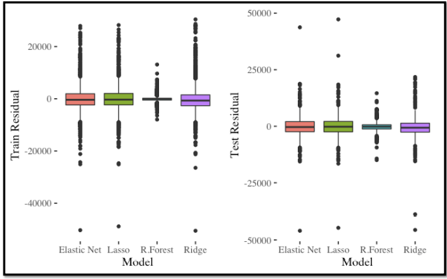

# Crypto Prediction with Alternative Data

## Data
For this project, we used the crpto data that we got from [Kaggle](https://www.kaggle.com/rafat97/cryptocurrency-price-prediction-by-ieee-ensi-sb). The data set have 48 features and 8,617 rows. However after removing the rows with missing values, we only have 2,391 rows left. We also removed columns that contained id's and lagged values. Therefore we have 40 features left. All of the features are numerical. Some examples of the features are:

- Related volume of posts from Reddit
- Related volume of comments from Reddit
- Volume of tweets 
- Related retweets
- Bulling sentiments extracted from relevant twitter conversations
- Bearish sentiments extracted from relevant twitter conversations

The response variable is bitcoin stock price. 

## Model fitting and Analysis
### Part I: R-Square, Residuals and Cross Validation Curves
We used 10-fold cross validation to tune the lambda values and use the minimum lambda value from cross validation to fit lasso, ridge and elastic net. We also fitted random forest. We repeated this 100 times and, training and test r-square, test and training residuals were computed each time. Below are the boxplots:

#### <u>R-Square</u>

All four models performed similarly on the training and test data. But test r-square values has more variation compared to the training r-square values. Performance of Elastic Net and Lasso is very similar to one another. Ridge regression performs slightly poor than both but above 70% for r-square is still decent. Random Forest performs the best, it can account of more than 90% of the variation.

#### <u>Residuals</u>

Both the train and test residuals are very similar for all four models. We can also notice many outliers.

#### <u>Cross Validation Curves</u>
Then we also plotted the cross validation curves of elastic net, lasso and ridge for the 100th iteration. They are given below:

We can see that Ridge gives us the lowest MSE when log(lambda) is less than 8. As for elastic net, it gives the lowest MSE for log(lambda) values between about 5 and 7. And Lasso gives the lowest MSE when log(lambda) is between 3.8 and 6. 

### Part II: Variable Importance
For this part of the project, we still fitted the same four models but this time we didn't divide the data into test and training sets and there was no loop. In this section we look into variable importance.

We can see that for all four models, volume of relevant tweets is important. For lasso, ridge and elastic net, volatility of the stock is most prominent with negative coefficient. Random forest has several important variables including Reddit comments, Very Bearish Tweets, etc.

### Part III: Accuracy Vs. Time 
In this part, we compute 90% confidence interval of the R-squares from part one and time it took to cross validate and/or fit the models once from part II. Below is the tables:

As we can see from the above figure, it takes 0.2 seconds to cross validate and fit lass, ridge and elastic net. But it takes 11.8 seconds to fit random forest, which performs much better than the other three. So is the improved accuracy worth increased time?

## Conclusion
We used alternative data to predict bitcoin stock prices. We fitted models such as random forest, elastic net, lasso and ridge regression. Random forest outperforms the other three but there is a time trade-off. 
